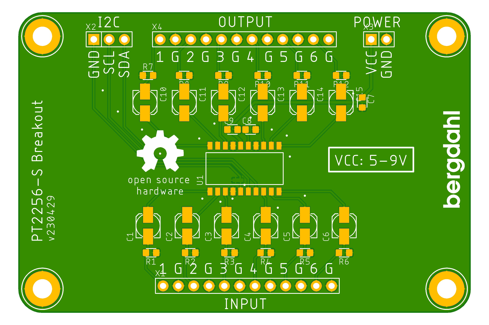

# Audio_PT2258-S_Breakout

This is a breakout board for the Princeton Technoloy PT2258-S chip. 

According to the manufacturer:
> PT2258 is a 6-Channel Electronic Volume Controller IC utilizing CMOS Technology specially designed
for the new generation of AV Multi-Channel Audio System. PT2258 provides an I2
C Control Interface,
an attenuation range of 0 to -79dB at 1dB/step, low noise, and high channel separation.

## I2C pins

Name | Description
---- | ----
GND | Ground
SCL | Serial clock line
SDA | Serial data line

## Inputs
Name | Description
---- | ----
1 | Input 1
2 | Input 2
3 | Input 3
4 | Input 4
5 | Input 5
6 | Input 6
GND | Ground (6 of them)

## Outputs
Name | Description
---- | ----
1 | Output 1
2 | Output 2
3 | Output 3
4 | Output 4
5 | Output 5
6 | Output 6
GND | Ground (6 of them)

## Power
Name | Description
---- | ----
VCC | 5-9V power
GND | Ground

